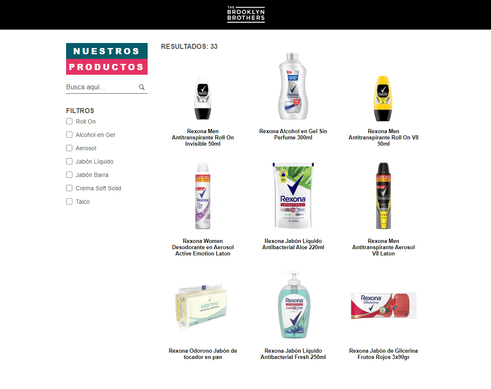
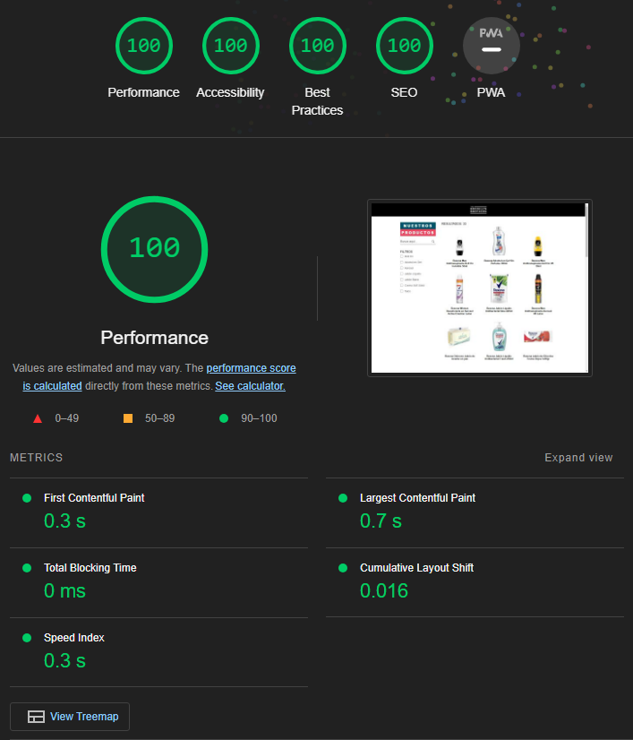

<h1 align="center">
    
</h1>

<p align="center">
  <a href="#-project">Project</a>&nbsp;&nbsp;&nbsp;|&nbsp;&nbsp;&nbsp;
  <a href="#-technologies">Technologies</a>&nbsp;&nbsp;&nbsp;|&nbsp;&nbsp;&nbsp;
  <a href="#-how-to-run">How to run</a>
</p>

<p align="center">
  
</p>

## 💻 Project

A product catalog web app developed during The Brooklyn Brothers's technical test using <b>React.js</b>, <b>TypeScript</b>, styles with <b>Sass</b>, data fetching with <b>Axios</b> and local back-end with <b>Json data file</b>.

## 💻 SEO Performance

The web application has been meticulously designed with a strong emphasis on achieving optimal <b>SEO</b> metrics. From its architecture to user interface, every detail has been carefully considered to enhance search engine visibility.

<p align="center">
  
</p>


## 🔧 Technologies

- [React.js](https://react.dev/)
- [TypeScript](https://www.typescriptlang.org/)
- [Sass](https://sass-lang.com/)
- [Axios](https://axios-http.com/docs/intro)

## 😊 How to run

Before starting, you need to have [Git](https://git-scm.com) and [Node](https://nodejs.org/en/) installed on your machine.

```sh
- Clone this repo:
$ git clone https://github.com/Gabriel02ps/tbb-productos.git

- Enter directory:
$ cd tbb-productos

- Install dependencies:
$ npm install

- Launch the app:
$ npm run dev
```

Have fun!
